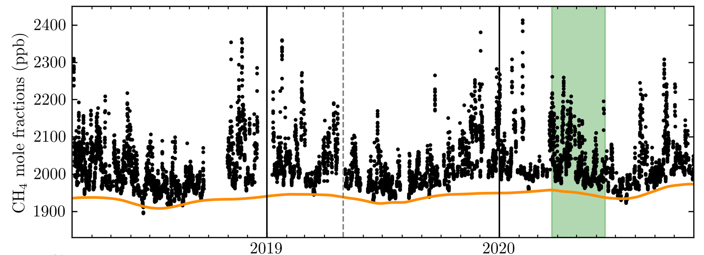

## Postdoctoral Associate | Massachusetts Institute of Technology

Hello!

I’m Eric, and I’m currently a Postdoctoral Research Associate in the Atmospheric Chemistry Research Group at the University of Bristol working with Prof. Matt Rigby and Dr. Anita Ganesan. In my current role as an atmospheric scientist I develop methods for quantifying sources and sinks of greenhouse gases using Bayesian statistical approaches. I recently completed my PhD in the Department of Physics at Imperial College London where I was supervised by Drs. Heather Graven and Tim Arnold (NPL). 

During my PhD I worked on developing regional measurement and modelling approaches for quantifying and attributing emissions of atmospheric methane. This included using the measurements shown in the figure below to evaluate the reported emissions for the London area.  

### Current Research Interests
- Regional atmospheric modelling of greenhouse gases (CO2, CH4, N2O)

- Application of Bayesian methods for source and sink attribution of greenhouse gases

- Using carbon isotopes as tracers of CO2 and CH4 emissions

_Atmospheric methane mole fraction measurements from Imperial College London_
