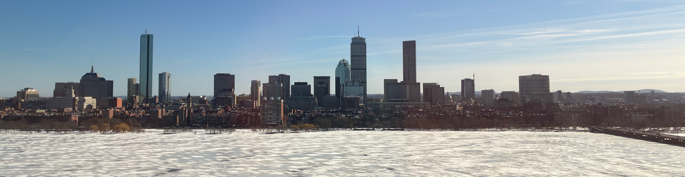

# Postdoctoral Associate | Massachusetts Institute of Technology
<figure>
    

Greetings from Earth's mighty troposphere, 

I'm Eric Saboya, your local atmospheric scientist based in the Department of Earth, Atmospheric and Planetary Sciences at MIT. 

In my current role, I develop methods for understanding the surface processes that lead to measurable changes in the atmospheric concentrations of various greenhouse gases. I do this through Bayesian inverse modelling a method that uses atmospheric trace gas concentrations to draw statistical inferences about emissions and removal processes occuring at the surface of our home, planet Earth. 

## Research Interests
- Regional atmospheric inverse modelling method development

- Methods of using co-emitting species and isotopic tracers for GHG emissions source partitioning 

- Emissions estimates of N2O and HFC-23

***
## Positions Held
#### Massachusetts Institute of Technology, Cambridge, MA, US | _Department of Earth, Atmospheric and Planetary Sciences_
Postdoctoral associate                   2026-

#### University of Bristol, Bristol, UK | _Department of Chemistry_
Hononary research associate              2025-

Research associate                       2022-2025

## Education
#### **Imperial College London,** London, UK | _Department of Physics_

PhD, Atmospheric Physics                 2022

MSc, Physics                             2018

#### **University of Surrey,** Guildford, Surrey | _Department of Mathematics_

BSc (Hons), Mathematics and Physics      2017
